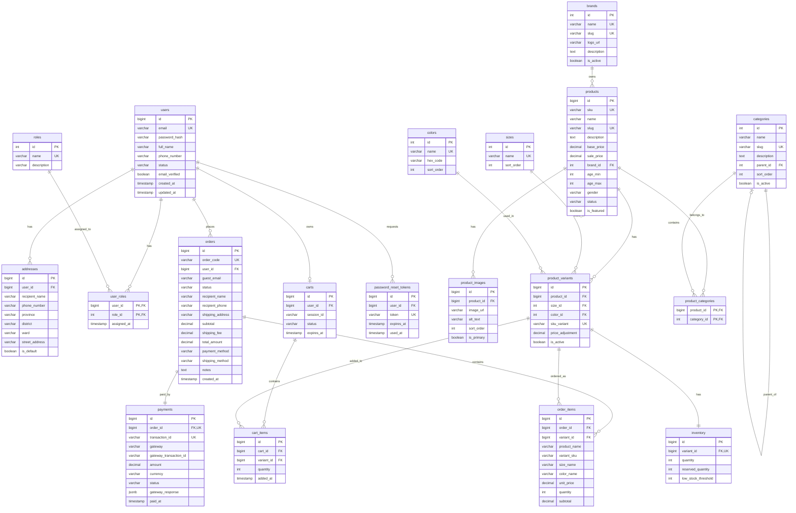

# Database Design Document
## Kids' Fashion E-Commerce Website
### Graduation Project - ReactJS + Spring Boot

---

## Table of Contents
1. [Database Choice & Justification](#1-database-choice--justification)
2. [High-Level Data Architecture Overview](#2-high-level-data-architecture-overview)
3. [Detailed Table Specifications](#3-detailed-table-specifications)
4. [Entity Relationship Diagram (ERD)](#4-entity-relationship-diagram-erd)
5. [Spring Boot & JPA/Hibernate Mapping Suggestions](#5-spring-boot--jpahibernate-mapping-suggestions)
6. [SQL Schema (DDL)](#6-sql-schema-ddl)
7. [Future Extension Suggestions](#7-future-extension-suggestions)

---

## 1. Database Choice & Justification

### Chosen Database: **PostgreSQL**

**Justification:**

| Criteria | PostgreSQL Advantage |
|----------|---------------------|
| **Data Integrity** | Superior constraint enforcement, CHECK constraints, and ENUM types for order/payment statuses |
| **JSON Support** | Native JSONB type for storing flexible payment gateway metadata |
| **Full-Text Search** | Built-in full-text search capabilities for product search functionality |
| **Array Types** | Native array support useful for storing multiple values without extra tables |
| **Performance** | Better performance for complex queries with multiple JOINs (orders + items + variants) |
| **Standards Compliance** | More SQL-standard compliant, better for learning and academic projects |
| **Spring Boot Integration** | Excellent support via Spring Data JPA with PostgreSQL dialect |
| **Future Scalability** | Better suited for growing e-commerce with advanced features |

---

## 2. High-Level Data Architecture Overview

### 2.1 Design Goals

1. **Normalization**: All tables normalized to 3NF to eliminate data redundancy
2. **Data Integrity**: Strong foreign key relationships and constraints
3. **Performance**: Strategic indexing for common query patterns
4. **Flexibility**: Support for product variants (size, color, age)
5. **Audit Trail**: Timestamps for tracking record creation and modifications
6. **Security**: Proper user role separation and account status management

### 2.2 Core Table Groups & Relationships

```
┌─────────────────────────────────────────────────────────────────────────────┐
│                           DATABASE ARCHITECTURE                              │
├─────────────────────────────────────────────────────────────────────────────┤
│                                                                              │
│  ┌──────────────┐         ┌──────────────┐         ┌──────────────┐        │
│  │    USERS     │         │   PRODUCTS   │         │    ORDERS    │        │
│  ├──────────────┤         ├──────────────┤         ├──────────────┤        │
│  │ users        │         │ products     │         │ orders       │        │
│  │ roles        │         │ categories   │         │ order_items  │        │
│  │ user_roles   │────────▶│ brands       │◀────────│ payments     │        │
│  │ addresses    │         │ variants     │         │ carts        │        │
│  └──────────────┘         │ images       │         │ cart_items   │        │
│         │                 │ inventory    │         └──────────────┘        │
│         │                 └──────────────┘                │                │
│         │                        │                        │                │
│         └────────────────────────┼────────────────────────┘                │
│                                  │                                          │
│                         [Unified by Foreign Keys]                           │
│                                                                              │
└─────────────────────────────────────────────────────────────────────────────┘
```

### 2.3 Main Relationship Summary

| Relationship | Type | Description |
|-------------|------|-------------|
| User → Roles | N:N | Users can have multiple roles (via user_roles) |
| User → Addresses | 1:N | One user can have multiple shipping addresses |
| User → Cart | 1:1 | Each registered user has one active cart |
| User → Orders | 1:N | One user can have multiple orders |
| Product → Categories | N:N | Products can belong to multiple categories |
| Product → Brand | N:1 | Each product belongs to one brand |
| Product → Variants | 1:N | One product has multiple variants (size/color) |
| Product → Images | 1:N | One product can have multiple images |
| Variant → Inventory | 1:1 | Each variant has one inventory record |
| Order → OrderItems | 1:N | One order contains multiple items |
| Order → Payment | 1:1 | Each order has one payment transaction |
| Cart → CartItems | 1:N | One cart contains multiple items |

---

## 3. Detailed Table Specifications

### 3.1 User Management Tables

#### Table: `users`
| Column | Data Type | Constraints | Description |
|--------|-----------|-------------|-------------|
| id | BIGSERIAL | PRIMARY KEY | Auto-increment ID |
| email | VARCHAR(255) | NOT NULL, UNIQUE | User email (login) |
| password_hash | VARCHAR(255) | NOT NULL | BCrypt hashed password |
| full_name | VARCHAR(150) | NOT NULL | User's full name |
| phone_number | VARCHAR(20) | NULL | Contact phone |
| avatar_url | VARCHAR(500) | NULL | Profile picture URL |
| status | VARCHAR(20) | NOT NULL, DEFAULT 'ACTIVE' | ACTIVE, LOCKED, PENDING |
| email_verified | BOOLEAN | DEFAULT FALSE | Email verification status |
| created_at | TIMESTAMP | DEFAULT CURRENT_TIMESTAMP | Record creation time |
| updated_at | TIMESTAMP | DEFAULT CURRENT_TIMESTAMP | Last update time |

**Indexes:**
- `idx_users_email` on `email` (for login lookups)
- `idx_users_status` on `status` (for admin filtering)
- `idx_users_phone` on `phone_number` (for search)

---

#### Table: `roles`
| Column | Data Type | Constraints | Description |
|--------|-----------|-------------|-------------|
| id | SERIAL | PRIMARY KEY | Auto-increment ID |
| name | VARCHAR(50) | NOT NULL, UNIQUE | Role name (GUEST, CUSTOMER, ADMIN) |
| description | VARCHAR(255) | NULL | Role description |
| created_at | TIMESTAMP | DEFAULT CURRENT_TIMESTAMP | Record creation time |

**Predefined Values:** GUEST, CUSTOMER, ADMIN

---

#### Table: `user_roles` (Join Table)
| Column | Data Type | Constraints | Description |
|--------|-----------|-------------|-------------|
| user_id | BIGINT | NOT NULL, FK → users(id) | Reference to user |
| role_id | INTEGER | NOT NULL, FK → roles(id) | Reference to role |
| assigned_at | TIMESTAMP | DEFAULT CURRENT_TIMESTAMP | When role was assigned |

**Primary Key:** Composite (user_id, role_id)

**Indexes:**
- `idx_user_roles_user` on `user_id`
- `idx_user_roles_role` on `role_id`

---

#### Table: `addresses`
| Column | Data Type | Constraints | Description |
|--------|-----------|-------------|-------------|
| id | BIGSERIAL | PRIMARY KEY | Auto-increment ID |
| user_id | BIGINT | NOT NULL, FK → users(id) | Reference to user |
| recipient_name | VARCHAR(150) | NOT NULL | Recipient's name |
| phone_number | VARCHAR(20) | NOT NULL | Contact phone |
| province | VARCHAR(100) | NOT NULL | Province/City |
| district | VARCHAR(100) | NOT NULL | District |
| ward | VARCHAR(100) | NOT NULL | Ward/Commune |
| street_address | VARCHAR(255) | NOT NULL | Detailed address |
| is_default | BOOLEAN | DEFAULT FALSE | Default shipping address |
| created_at | TIMESTAMP | DEFAULT CURRENT_TIMESTAMP | Record creation time |
| updated_at | TIMESTAMP | DEFAULT CURRENT_TIMESTAMP | Last update time |

**Indexes:**
- `idx_addresses_user` on `user_id`
- `idx_addresses_default` on `(user_id, is_default)`

---

### 3.2 Product Management Tables

#### Table: `brands`
| Column | Data Type | Constraints | Description |
|--------|-----------|-------------|-------------|
| id | SERIAL | PRIMARY KEY | Auto-increment ID |
| name | VARCHAR(100) | NOT NULL, UNIQUE | Brand name |
| slug | VARCHAR(120) | NOT NULL, UNIQUE | URL-friendly name |
| logo_url | VARCHAR(500) | NULL | Brand logo image |
| description | TEXT | NULL | Brand description |
| is_active | BOOLEAN | DEFAULT TRUE | Active status |
| created_at | TIMESTAMP | DEFAULT CURRENT_TIMESTAMP | Record creation time |
| updated_at | TIMESTAMP | DEFAULT CURRENT_TIMESTAMP | Last update time |

**Indexes:**
- `idx_brands_slug` on `slug`
- `idx_brands_active` on `is_active`

---

#### Table: `categories`
| Column | Data Type | Constraints | Description |
|--------|-----------|-------------|-------------|
| id | SERIAL | PRIMARY KEY | Auto-increment ID |
| name | VARCHAR(100) | NOT NULL | Category name |
| slug | VARCHAR(120) | NOT NULL, UNIQUE | URL-friendly name |
| description | TEXT | NULL | Category description |
| image_url | VARCHAR(500) | NULL | Category image |
| parent_id | INTEGER | NULL, FK → categories(id) | Parent category (for hierarchy) |
| sort_order | INTEGER | DEFAULT 0 | Display order |
| is_active | BOOLEAN | DEFAULT TRUE | Active status |
| created_at | TIMESTAMP | DEFAULT CURRENT_TIMESTAMP | Record creation time |
| updated_at | TIMESTAMP | DEFAULT CURRENT_TIMESTAMP | Last update time |

**Indexes:**
- `idx_categories_slug` on `slug`
- `idx_categories_parent` on `parent_id`
- `idx_categories_active` on `is_active`

**Note:** Self-referencing for hierarchical categories (e.g., Boys → Shirts → T-Shirts)

---

#### Table: `products`
| Column | Data Type | Constraints | Description |
|--------|-----------|-------------|-------------|
| id | BIGSERIAL | PRIMARY KEY | Auto-increment ID |
| sku | VARCHAR(50) | NOT NULL, UNIQUE | Stock Keeping Unit |
| name | VARCHAR(255) | NOT NULL | Product name |
| slug | VARCHAR(280) | NOT NULL, UNIQUE | URL-friendly name |
| description | TEXT | NULL | Full description |
| short_description | VARCHAR(500) | NULL | Brief description |
| base_price | DECIMAL(12,2) | NOT NULL, CHECK (>= 0) | Base price |
| sale_price | DECIMAL(12,2) | NULL, CHECK (>= 0) | Sale price (if on sale) |
| brand_id | INTEGER | NOT NULL, FK → brands(id) | Reference to brand |
| age_min | INTEGER | NULL, CHECK (>= 0) | Minimum age (months) |
| age_max | INTEGER | NULL, CHECK (>= 0) | Maximum age (months) |
| gender | VARCHAR(20) | NULL | BOYS, GIRLS, UNISEX |
| material | VARCHAR(100) | NULL | Product material |
| status | VARCHAR(20) | NOT NULL, DEFAULT 'ACTIVE' | ACTIVE, INACTIVE, DRAFT |
| is_featured | BOOLEAN | DEFAULT FALSE | Featured product flag |
| view_count | BIGINT | DEFAULT 0 | View counter |
| created_at | TIMESTAMP | DEFAULT CURRENT_TIMESTAMP | Record creation time |
| updated_at | TIMESTAMP | DEFAULT CURRENT_TIMESTAMP | Last update time |

**Indexes:**
- `idx_products_sku` on `sku`
- `idx_products_slug` on `slug`
- `idx_products_brand` on `brand_id`
- `idx_products_status` on `status`
- `idx_products_price` on `base_price`
- `idx_products_gender` on `gender`
- `idx_products_age` on `(age_min, age_max)`
- `idx_products_featured` on `is_featured`
- `idx_products_search` on `name` using GIN (for full-text search)

---

#### Table: `product_categories` (Join Table)
| Column | Data Type | Constraints | Description |
|--------|-----------|-------------|-------------|
| product_id | BIGINT | NOT NULL, FK → products(id) | Reference to product |
| category_id | INTEGER | NOT NULL, FK → categories(id) | Reference to category |

**Primary Key:** Composite (product_id, category_id)

**Indexes:**
- `idx_product_categories_product` on `product_id`
- `idx_product_categories_category` on `category_id`

---

#### Table: `product_images`
| Column | Data Type | Constraints | Description |
|--------|-----------|-------------|-------------|
| id | BIGSERIAL | PRIMARY KEY | Auto-increment ID |
| product_id | BIGINT | NOT NULL, FK → products(id) | Reference to product |
| image_url | VARCHAR(500) | NOT NULL | Image URL |
| alt_text | VARCHAR(255) | NULL | Image alt text |
| sort_order | INTEGER | DEFAULT 0 | Display order |
| is_primary | BOOLEAN | DEFAULT FALSE | Primary image flag |
| created_at | TIMESTAMP | DEFAULT CURRENT_TIMESTAMP | Record creation time |

**Indexes:**
- `idx_product_images_product` on `product_id`
- `idx_product_images_primary` on `(product_id, is_primary)`

---

#### Table: `sizes`
| Column | Data Type | Constraints | Description |
|--------|-----------|-------------|-------------|
| id | SERIAL | PRIMARY KEY | Auto-increment ID |
| name | VARCHAR(20) | NOT NULL, UNIQUE | Size name (S, M, L, XL, 80, 90, 100, etc.) |
| sort_order | INTEGER | DEFAULT 0 | Display order |

---

#### Table: `colors`
| Column | Data Type | Constraints | Description |
|--------|-----------|-------------|-------------|
| id | SERIAL | PRIMARY KEY | Auto-increment ID |
| name | VARCHAR(50) | NOT NULL, UNIQUE | Color name |
| hex_code | VARCHAR(7) | NULL | Hex color code (#FFFFFF) |
| sort_order | INTEGER | DEFAULT 0 | Display order |

---

#### Table: `product_variants`
| Column | Data Type | Constraints | Description |
|--------|-----------|-------------|-------------|
| id | BIGSERIAL | PRIMARY KEY | Auto-increment ID |
| product_id | BIGINT | NOT NULL, FK → products(id) | Reference to product |
| size_id | INTEGER | NOT NULL, FK → sizes(id) | Reference to size |
| color_id | INTEGER | NOT NULL, FK → colors(id) | Reference to color |
| sku_variant | VARCHAR(80) | NOT NULL, UNIQUE | Variant SKU (PROD-SKU-S-RED) |
| price_adjustment | DECIMAL(12,2) | DEFAULT 0 | Price +/- from base |
| image_url | VARCHAR(500) | NULL | Variant-specific image |
| is_active | BOOLEAN | DEFAULT TRUE | Active status |
| created_at | TIMESTAMP | DEFAULT CURRENT_TIMESTAMP | Record creation time |
| updated_at | TIMESTAMP | DEFAULT CURRENT_TIMESTAMP | Last update time |

**Unique Constraint:** (product_id, size_id, color_id)

**Indexes:**
- `idx_variants_product` on `product_id`
- `idx_variants_size` on `size_id`
- `idx_variants_color` on `color_id`
- `idx_variants_sku` on `sku_variant`
- `idx_variants_composite` on `(product_id, size_id, color_id)`

---

#### Table: `inventory`
| Column | Data Type | Constraints | Description |
|--------|-----------|-------------|-------------|
| id | BIGSERIAL | PRIMARY KEY | Auto-increment ID |
| variant_id | BIGINT | NOT NULL, UNIQUE, FK → product_variants(id) | Reference to variant |
| quantity | INTEGER | NOT NULL, DEFAULT 0, CHECK (>= 0) | Available stock |
| reserved_quantity | INTEGER | NOT NULL, DEFAULT 0, CHECK (>= 0) | Reserved (in carts/pending orders) |
| low_stock_threshold | INTEGER | DEFAULT 10 | Low stock alert threshold |
| updated_at | TIMESTAMP | DEFAULT CURRENT_TIMESTAMP | Last update time |

**Indexes:**
- `idx_inventory_variant` on `variant_id`
- `idx_inventory_quantity` on `quantity`
- `idx_inventory_low_stock` on `(quantity, low_stock_threshold)`

---

### 3.3 Shopping Cart Tables

#### Table: `carts`
| Column | Data Type | Constraints | Description |
|--------|-----------|-------------|-------------|
| id | BIGSERIAL | PRIMARY KEY | Auto-increment ID |
| user_id | BIGINT | NULL, FK → users(id) | For registered users |
| session_id | VARCHAR(128) | NULL | For guest users |
| status | VARCHAR(20) | DEFAULT 'ACTIVE' | ACTIVE, MERGED, ABANDONED |
| expires_at | TIMESTAMP | NULL | Cart expiration (for guests) |
| created_at | TIMESTAMP | DEFAULT CURRENT_TIMESTAMP | Record creation time |
| updated_at | TIMESTAMP | DEFAULT CURRENT_TIMESTAMP | Last update time |

**Check Constraint:** Either user_id OR session_id must be NOT NULL

**Indexes:**
- `idx_carts_user` on `user_id`
- `idx_carts_session` on `session_id`
- `idx_carts_status` on `status`
- `idx_carts_expires` on `expires_at`

---

#### Table: `cart_items`
| Column | Data Type | Constraints | Description |
|--------|-----------|-------------|-------------|
| id | BIGSERIAL | PRIMARY KEY | Auto-increment ID |
| cart_id | BIGINT | NOT NULL, FK → carts(id) | Reference to cart |
| variant_id | BIGINT | NOT NULL, FK → product_variants(id) | Reference to variant |
| quantity | INTEGER | NOT NULL, CHECK (> 0) | Item quantity |
| added_at | TIMESTAMP | DEFAULT CURRENT_TIMESTAMP | When item was added |
| updated_at | TIMESTAMP | DEFAULT CURRENT_TIMESTAMP | Last update time |

**Unique Constraint:** (cart_id, variant_id) - prevent duplicate items

**Indexes:**
- `idx_cart_items_cart` on `cart_id`
- `idx_cart_items_variant` on `variant_id`

---

### 3.4 Order Management Tables

#### Table: `orders`
| Column | Data Type | Constraints | Description |
|--------|-----------|-------------|-------------|
| id | BIGSERIAL | PRIMARY KEY | Auto-increment ID |
| order_code | VARCHAR(30) | NOT NULL, UNIQUE | Human-readable order code |
| user_id | BIGINT | NULL, FK → users(id) | Reference to user (NULL for guest) |
| guest_email | VARCHAR(255) | NULL | Guest customer email |
| status | VARCHAR(20) | NOT NULL, DEFAULT 'PENDING' | Order status |
| recipient_name | VARCHAR(150) | NOT NULL | Recipient's name |
| recipient_phone | VARCHAR(20) | NOT NULL | Recipient's phone |
| shipping_province | VARCHAR(100) | NOT NULL | Shipping province |
| shipping_district | VARCHAR(100) | NOT NULL | Shipping district |
| shipping_ward | VARCHAR(100) | NOT NULL | Shipping ward |
| shipping_address | VARCHAR(255) | NOT NULL | Detailed address |
| subtotal | DECIMAL(14,2) | NOT NULL, CHECK (>= 0) | Sum of item prices |
| shipping_fee | DECIMAL(10,2) | NOT NULL, DEFAULT 0, CHECK (>= 0) | Shipping cost |
| total_amount | DECIMAL(14,2) | NOT NULL, CHECK (>= 0) | Final total |
| payment_method | VARCHAR(30) | NOT NULL | VNPAY, MOMO, COD, etc. |
| shipping_method | VARCHAR(50) | NULL | Standard, Express, etc. |
| notes | TEXT | NULL | Customer notes |
| paid_at | TIMESTAMP | NULL | Payment timestamp |
| shipped_at | TIMESTAMP | NULL | Shipment timestamp |
| completed_at | TIMESTAMP | NULL | Completion timestamp |
| cancelled_at | TIMESTAMP | NULL | Cancellation timestamp |
| cancellation_reason | VARCHAR(500) | NULL | Reason for cancellation |
| created_at | TIMESTAMP | DEFAULT CURRENT_TIMESTAMP | Order creation time |
| updated_at | TIMESTAMP | DEFAULT CURRENT_TIMESTAMP | Last update time |

**Order Status Values:** PENDING, PAID, PROCESSING, SHIPPING, COMPLETED, CANCELLED

**Indexes:**
- `idx_orders_code` on `order_code`
- `idx_orders_user` on `user_id`
- `idx_orders_status` on `status`
- `idx_orders_created` on `created_at`
- `idx_orders_guest_email` on `guest_email`

---

#### Table: `order_items`
| Column | Data Type | Constraints | Description |
|--------|-----------|-------------|-------------|
| id | BIGSERIAL | PRIMARY KEY | Auto-increment ID |
| order_id | BIGINT | NOT NULL, FK → orders(id) | Reference to order |
| variant_id | BIGINT | NOT NULL, FK → product_variants(id) | Reference to variant |
| product_name | VARCHAR(255) | NOT NULL | Snapshot: product name |
| variant_sku | VARCHAR(80) | NOT NULL | Snapshot: variant SKU |
| size_name | VARCHAR(20) | NOT NULL | Snapshot: size |
| color_name | VARCHAR(50) | NOT NULL | Snapshot: color |
| unit_price | DECIMAL(12,2) | NOT NULL, CHECK (>= 0) | Snapshot: price at purchase |
| quantity | INTEGER | NOT NULL, CHECK (> 0) | Quantity ordered |
| subtotal | DECIMAL(14,2) | NOT NULL, CHECK (>= 0) | unit_price × quantity |
| product_image_url | VARCHAR(500) | NULL | Snapshot: product image |
| created_at | TIMESTAMP | DEFAULT CURRENT_TIMESTAMP | Record creation time |

**Indexes:**
- `idx_order_items_order` on `order_id`
- `idx_order_items_variant` on `variant_id`

---

### 3.5 Payment Tables

#### Table: `payments`
| Column | Data Type | Constraints | Description |
|--------|-----------|-------------|-------------|
| id | BIGSERIAL | PRIMARY KEY | Auto-increment ID |
| order_id | BIGINT | NOT NULL, UNIQUE, FK → orders(id) | Reference to order |
| transaction_id | VARCHAR(100) | NOT NULL, UNIQUE | Internal transaction ID |
| gateway | VARCHAR(30) | NOT NULL | VNPAY, MOMO, STRIPE, PAYPAL |
| gateway_transaction_id | VARCHAR(150) | NULL | Gateway's transaction ID |
| amount | DECIMAL(14,2) | NOT NULL, CHECK (> 0) | Payment amount |
| currency | VARCHAR(3) | NOT NULL, DEFAULT 'VND' | Currency code |
| status | VARCHAR(20) | NOT NULL, DEFAULT 'PENDING' | Payment status |
| payment_method | VARCHAR(50) | NULL | Card type, bank, wallet, etc. |
| payer_email | VARCHAR(255) | NULL | Payer's email (from gateway) |
| gateway_response | JSONB | NULL | Raw response from gateway |
| metadata | JSONB | NULL | Additional data |
| paid_at | TIMESTAMP | NULL | Successful payment time |
| failed_at | TIMESTAMP | NULL | Failed payment time |
| failure_reason | VARCHAR(500) | NULL | Failure reason |
| created_at | TIMESTAMP | DEFAULT CURRENT_TIMESTAMP | Record creation time |
| updated_at | TIMESTAMP | DEFAULT CURRENT_TIMESTAMP | Last update time |

**Payment Status Values:** PENDING, PROCESSING, SUCCESS, FAILED, REFUNDED, CANCELLED

**Indexes:**
- `idx_payments_order` on `order_id`
- `idx_payments_transaction` on `transaction_id`
- `idx_payments_gateway_txn` on `gateway_transaction_id`
- `idx_payments_status` on `status`
- `idx_payments_gateway` on `gateway`

---

### 3.6 Password Reset Token (for Forgot Password)

#### Table: `password_reset_tokens`
| Column | Data Type | Constraints | Description |
|--------|-----------|-------------|-------------|
| id | BIGSERIAL | PRIMARY KEY | Auto-increment ID |
| user_id | BIGINT | NOT NULL, FK → users(id) | Reference to user |
| token | VARCHAR(255) | NOT NULL, UNIQUE | Reset token |
| expires_at | TIMESTAMP | NOT NULL | Token expiration |
| used_at | TIMESTAMP | NULL | When token was used |
| created_at | TIMESTAMP | DEFAULT CURRENT_TIMESTAMP | Record creation time |

**Indexes:**
- `idx_reset_tokens_user` on `user_id`
- `idx_reset_tokens_token` on `token`
- `idx_reset_tokens_expires` on `expires_at`

---

## 4. Entity Relationship Diagram (ERD)

### 4.1 Text Description

```
ENTITIES AND RELATIONSHIPS:

[users] 1 ──────< N [addresses]
    │                    User can have multiple shipping addresses
    │
    │ N
    ├────────< [user_roles] >────────┤ N
    │              │                 │
    │              │                 [roles]
    │              │                 User-Role many-to-many relationship
    │
    │ 1
    ├──────────────< N [orders]
    │                    │           User can have multiple orders
    │                    │
    │                    │ 1
    │                    └─────< N [order_items]
    │                    │           Order contains multiple items
    │                    │
    │                    │ 1
    │                    └─────── 1 [payments]
    │                                One payment per order
    │ 1
    └──────────────── 1 [carts]
                         │           User has one active cart
                         │ 1
                         └─────< N [cart_items]
                                     Cart contains multiple items

[brands] 1 ────────< N [products]
                         │           Brand has multiple products
                         │
                         │ N
                         ├────────< [product_categories] >────────┤ N
                         │              │                         │
                         │              │                    [categories]
                         │              │                    Product-Category M:N
                         │
                         │ 1
                         ├──────< N [product_images]
                         │              Product has multiple images
                         │
                         │ 1
                         └──────< N [product_variants]
                                      │    Product has multiple variants
                                      │
                                      │ N        N
                                      ├─────────┤
                                      │    [sizes]
                                      │    
                                      │ N        N
                                      ├─────────┤
                                      │    [colors]
                                      │
                                      │ 1
                                      └───── 1 [inventory]
                                                 Each variant has inventory
```

### 4.2 Mermaid ERD Diagram



### 4.3 PlantUML ERD Diagram


---

## 5. Spring Boot & JPA/Hibernate Mapping Suggestions

### 5.1 Entity Class Overview

| Table | Entity Class | Package |
|-------|-------------|---------|
| users | User | com.kidsfashion.entity |
| roles | Role | com.kidsfashion.entity |
| user_roles | (Embedded in User/Role) | - |
| addresses | Address | com.kidsfashion.entity |
| brands | Brand | com.kidsfashion.entity |
| categories | Category | com.kidsfashion.entity |
| products | Product | com.kidsfashion.entity |
| product_categories | (Embedded in Product/Category) | - |
| product_images | ProductImage | com.kidsfashion.entity |
| sizes | Size | com.kidsfashion.entity |
| colors | Color | com.kidsfashion.entity |
| product_variants | ProductVariant | com.kidsfashion.entity |
| inventory | Inventory | com.kidsfashion.entity |
| carts | Cart | com.kidsfashion.entity |
| cart_items | CartItem | com.kidsfashion.entity |
| orders | Order | com.kidsfashion.entity |
| order_items | OrderItem | com.kidsfashion.entity |
| payments | Payment | com.kidsfashion.entity |
| password_reset_tokens | PasswordResetToken | com.kidsfashion.entity |

### 5.2 Entity Relationship Annotations

#### User Entity
```java
@Entity
@Table(name = "users")
public class User {
    @Id
    @GeneratedValue(strategy = GenerationType.IDENTITY)
    private Long id;
    
    @Column(unique = true, nullable = false)
    private String email;
    
    @Column(name = "password_hash", nullable = false)
    private String passwordHash;
    
    // Many-to-Many with Role
    @ManyToMany(fetch = FetchType.LAZY)
    @JoinTable(
        name = "user_roles",
        joinColumns = @JoinColumn(name = "user_id"),
        inverseJoinColumns = @JoinColumn(name = "role_id")
    )
    private Set<Role> roles = new HashSet<>();
    
    // One-to-Many with Address
    @OneToMany(mappedBy = "user", cascade = CascadeType.ALL, orphanRemoval = true)
    private List<Address> addresses = new ArrayList<>();
    
    // One-to-One with Cart
    @OneToOne(mappedBy = "user", cascade = CascadeType.ALL)
    private Cart cart;
    
    // One-to-Many with Order
    @OneToMany(mappedBy = "user", fetch = FetchType.LAZY)
    private List<Order> orders = new ArrayList<>();
    
    @Enumerated(EnumType.STRING)
    private UserStatus status = UserStatus.ACTIVE;
    
    // ... other fields, getters, setters
}
```

#### Role Entity
```java
@Entity
@Table(name = "roles")
public class Role {
    @Id
    @GeneratedValue(strategy = GenerationType.IDENTITY)
    private Integer id;
    
    @Column(unique = true, nullable = false)
    private String name;
    
    @ManyToMany(mappedBy = "roles")
    private Set<User> users = new HashSet<>();
    
    // ... getters, setters
}
```

#### Address Entity
```java
@Entity
@Table(name = "addresses")
public class Address {
    @Id
    @GeneratedValue(strategy = GenerationType.IDENTITY)
    private Long id;
    
    @ManyToOne(fetch = FetchType.LAZY)
    @JoinColumn(name = "user_id", nullable = false)
    private User user;
    
    @Column(name = "recipient_name", nullable = false)
    private String recipientName;
    
    // ... other fields
}
```

#### Product Entity
```java
@Entity
@Table(name = "products")
public class Product {
    @Id
    @GeneratedValue(strategy = GenerationType.IDENTITY)
    private Long id;
    
    @Column(unique = true, nullable = false)
    private String sku;
    
    @Column(nullable = false)
    private String name;
    
    @Column(name = "base_price", nullable = false)
    private BigDecimal basePrice;
    
    @Column(name = "sale_price")
    private BigDecimal salePrice;
    
    // Many-to-One with Brand
    @ManyToOne(fetch = FetchType.LAZY)
    @JoinColumn(name = "brand_id", nullable = false)
    private Brand brand;
    
    // Many-to-Many with Category
    @ManyToMany
    @JoinTable(
        name = "product_categories",
        joinColumns = @JoinColumn(name = "product_id"),
        inverseJoinColumns = @JoinColumn(name = "category_id")
    )
    private Set<Category> categories = new HashSet<>();
    
    // One-to-Many with ProductImage
    @OneToMany(mappedBy = "product", cascade = CascadeType.ALL, orphanRemoval = true)
    @OrderBy("sortOrder ASC")
    private List<ProductImage> images = new ArrayList<>();
    
    // One-to-Many with ProductVariant
    @OneToMany(mappedBy = "product", cascade = CascadeType.ALL, orphanRemoval = true)
    private List<ProductVariant> variants = new ArrayList<>();
    
    @Enumerated(EnumType.STRING)
    private ProductStatus status = ProductStatus.ACTIVE;
    
    @Enumerated(EnumType.STRING)
    private Gender gender;
    
    // ... other fields
}
```

#### ProductVariant Entity
```java
@Entity
@Table(name = "product_variants",
    uniqueConstraints = @UniqueConstraint(columnNames = {"product_id", "size_id", "color_id"}))
public class ProductVariant {
    @Id
    @GeneratedValue(strategy = GenerationType.IDENTITY)
    private Long id;
    
    @ManyToOne(fetch = FetchType.LAZY)
    @JoinColumn(name = "product_id", nullable = false)
    private Product product;
    
    @ManyToOne(fetch = FetchType.LAZY)
    @JoinColumn(name = "size_id", nullable = false)
    private Size size;
    
    @ManyToOne(fetch = FetchType.LAZY)
    @JoinColumn(name = "color_id", nullable = false)
    private Color color;
    
    @Column(name = "sku_variant", unique = true, nullable = false)
    private String skuVariant;
    
    // One-to-One with Inventory
    @OneToOne(mappedBy = "variant", cascade = CascadeType.ALL)
    private Inventory inventory;
    
    // ... other fields
}
```

#### Category Entity (Self-referencing for hierarchy)
```java
@Entity
@Table(name = "categories")
public class Category {
    @Id
    @GeneratedValue(strategy = GenerationType.IDENTITY)
    private Integer id;
    
    @Column(nullable = false)
    private String name;
    
    @Column(unique = true, nullable = false)
    private String slug;
    
    // Self-referencing Many-to-One (Parent)
    @ManyToOne(fetch = FetchType.LAZY)
    @JoinColumn(name = "parent_id")
    private Category parent;
    
    // Self-referencing One-to-Many (Children)
    @OneToMany(mappedBy = "parent")
    private List<Category> children = new ArrayList<>();
    
    @ManyToMany(mappedBy = "categories")
    private Set<Product> products = new HashSet<>();
    
    // ... other fields
}
```

#### Cart Entity
```java
@Entity
@Table(name = "carts")
public class Cart {
    @Id
    @GeneratedValue(strategy = GenerationType.IDENTITY)
    private Long id;
    
    // One-to-One with User (nullable for guest carts)
    @OneToOne(fetch = FetchType.LAZY)
    @JoinColumn(name = "user_id")
    private User user;
    
    @Column(name = "session_id")
    private String sessionId;
    
    // One-to-Many with CartItem
    @OneToMany(mappedBy = "cart", cascade = CascadeType.ALL, orphanRemoval = true)
    private List<CartItem> items = new ArrayList<>();
    
    @Enumerated(EnumType.STRING)
    private CartStatus status = CartStatus.ACTIVE;
    
    // ... other fields
}
```

#### Order Entity
```java
@Entity
@Table(name = "orders")
public class Order {
    @Id
    @GeneratedValue(strategy = GenerationType.IDENTITY)
    private Long id;
    
    @Column(name = "order_code", unique = true, nullable = false)
    private String orderCode;
    
    @ManyToOne(fetch = FetchType.LAZY)
    @JoinColumn(name = "user_id")
    private User user;
    
    // One-to-Many with OrderItem
    @OneToMany(mappedBy = "order", cascade = CascadeType.ALL, orphanRemoval = true)
    private List<OrderItem> items = new ArrayList<>();
    
    // One-to-One with Payment
    @OneToOne(mappedBy = "order", cascade = CascadeType.ALL)
    private Payment payment;
    
    @Enumerated(EnumType.STRING)
    private OrderStatus status = OrderStatus.PENDING;
    
    @Column(name = "total_amount", nullable = false)
    private BigDecimal totalAmount;
    
    // ... other fields (recipient info, shipping info, etc.)
}
```

#### Payment Entity
```java
@Entity
@Table(name = "payments")
public class Payment {
    @Id
    @GeneratedValue(strategy = GenerationType.IDENTITY)
    private Long id;
    
    @OneToOne(fetch = FetchType.LAZY)
    @JoinColumn(name = "order_id", nullable = false, unique = true)
    private Order order;
    
    @Column(name = "transaction_id", unique = true, nullable = false)
    private String transactionId;
    
    @Enumerated(EnumType.STRING)
    private PaymentGateway gateway;
    
    @Column(name = "gateway_transaction_id")
    private String gatewayTransactionId;
    
    @Column(nullable = false)
    private BigDecimal amount;
    
    @Enumerated(EnumType.STRING)
    private PaymentStatus status = PaymentStatus.PENDING;
    
    // JSONB stored as String or using Hibernate Types
    @Type(type = "jsonb")
    @Column(name = "gateway_response", columnDefinition = "jsonb")
    private Map<String, Object> gatewayResponse;
    
    // ... other fields
}
```

### 5.3 Enum Classes

```java
// User Status
public enum UserStatus {
    ACTIVE, LOCKED, PENDING
}

// Product Status
public enum ProductStatus {
    ACTIVE, INACTIVE, DRAFT
}

// Gender
public enum Gender {
    BOYS, GIRLS, UNISEX
}

// Cart Status
public enum CartStatus {
    ACTIVE, MERGED, ABANDONED
}

// Order Status
public enum OrderStatus {
    PENDING, PAID, PROCESSING, SHIPPING, COMPLETED, CANCELLED
}

// Payment Gateway
public enum PaymentGateway {
    VNPAY, MOMO, STRIPE, PAYPAL, COD
}

// Payment Status
public enum PaymentStatus {
    PENDING, PROCESSING, SUCCESS, FAILED, REFUNDED, CANCELLED
}
```

### 5.4 Base Entity (Auditing)

```java
@MappedSuperclass
@EntityListeners(AuditingEntityListener.class)
public abstract class BaseEntity {
    
    @CreatedDate
    @Column(name = "created_at", nullable = false, updatable = false)
    private LocalDateTime createdAt;
    
    @LastModifiedDate
    @Column(name = "updated_at")
    private LocalDateTime updatedAt;
    
    // Getters and setters
}
```

---

## 6. SQL Schema (DDL)

```sql
-- =====================================================
-- Kids Fashion E-Commerce Database Schema
-- Database: PostgreSQL
-- =====================================================

-- Enable UUID extension (optional, for future use)
CREATE EXTENSION IF NOT EXISTS "uuid-ossp";

-- =====================================================
-- 1. USER MANAGEMENT TABLES
-- =====================================================

-- Roles Table
CREATE TABLE roles (
    id SERIAL PRIMARY KEY,
    name VARCHAR(50) NOT NULL UNIQUE,
    description VARCHAR(255),
    created_at TIMESTAMP DEFAULT CURRENT_TIMESTAMP
);

-- Insert default roles
INSERT INTO roles (name, description) VALUES 
    ('GUEST', 'Guest user with limited access'),
    ('CUSTOMER', 'Registered customer'),
    ('ADMIN', 'Administrator with full access');

-- Users Table
CREATE TABLE users (
    id BIGSERIAL PRIMARY KEY,
    email VARCHAR(255) NOT NULL UNIQUE,
    password_hash VARCHAR(255) NOT NULL,
    full_name VARCHAR(150) NOT NULL,
    phone_number VARCHAR(20),
    avatar_url VARCHAR(500),
    status VARCHAR(20) NOT NULL DEFAULT 'ACTIVE' 
        CHECK (status IN ('ACTIVE', 'LOCKED', 'PENDING')),
    email_verified BOOLEAN DEFAULT FALSE,
    created_at TIMESTAMP DEFAULT CURRENT_TIMESTAMP,
    updated_at TIMESTAMP DEFAULT CURRENT_TIMESTAMP
);

-- Create indexes for users
CREATE INDEX idx_users_email ON users(email);
CREATE INDEX idx_users_status ON users(status);
CREATE INDEX idx_users_phone ON users(phone_number);

-- User Roles Junction Table
CREATE TABLE user_roles (
    user_id BIGINT NOT NULL REFERENCES users(id) ON DELETE CASCADE,
    role_id INTEGER NOT NULL REFERENCES roles(id) ON DELETE CASCADE,
    assigned_at TIMESTAMP DEFAULT CURRENT_TIMESTAMP,
    PRIMARY KEY (user_id, role_id)
);

CREATE INDEX idx_user_roles_user ON user_roles(user_id);
CREATE INDEX idx_user_roles_role ON user_roles(role_id);

-- Addresses Table
CREATE TABLE addresses (
    id BIGSERIAL PRIMARY KEY,
    user_id BIGINT NOT NULL REFERENCES users(id) ON DELETE CASCADE,
    recipient_name VARCHAR(150) NOT NULL,
    phone_number VARCHAR(20) NOT NULL,
    province VARCHAR(100) NOT NULL,
    district VARCHAR(100) NOT NULL,
    ward VARCHAR(100) NOT NULL,
    street_address VARCHAR(255) NOT NULL,
    is_default BOOLEAN DEFAULT FALSE,
    created_at TIMESTAMP DEFAULT CURRENT_TIMESTAMP,
    updated_at TIMESTAMP DEFAULT CURRENT_TIMESTAMP
);

CREATE INDEX idx_addresses_user ON addresses(user_id);
CREATE INDEX idx_addresses_default ON addresses(user_id, is_default);

-- Password Reset Tokens Table
CREATE TABLE password_reset_tokens (
    id BIGSERIAL PRIMARY KEY,
    user_id BIGINT NOT NULL REFERENCES users(id) ON DELETE CASCADE,
    token VARCHAR(255) NOT NULL UNIQUE,
    expires_at TIMESTAMP NOT NULL,
    used_at TIMESTAMP,
    created_at TIMESTAMP DEFAULT CURRENT_TIMESTAMP
);

CREATE INDEX idx_reset_tokens_user ON password_reset_tokens(user_id);
CREATE INDEX idx_reset_tokens_token ON password_reset_tokens(token);
CREATE INDEX idx_reset_tokens_expires ON password_reset_tokens(expires_at);

-- =====================================================
-- 2. PRODUCT MANAGEMENT TABLES
-- =====================================================

-- Brands Table
CREATE TABLE brands (
    id SERIAL PRIMARY KEY,
    name VARCHAR(100) NOT NULL UNIQUE,
    slug VARCHAR(120) NOT NULL UNIQUE,
    logo_url VARCHAR(500),
    description TEXT,
    is_active BOOLEAN DEFAULT TRUE,
    created_at TIMESTAMP DEFAULT CURRENT_TIMESTAMP,
    updated_at TIMESTAMP DEFAULT CURRENT_TIMESTAMP
);

CREATE INDEX idx_brands_slug ON brands(slug);
CREATE INDEX idx_brands_active ON brands(is_active);

-- Categories Table (Self-referencing for hierarchy)
CREATE TABLE categories (
    id SERIAL PRIMARY KEY,
    name VARCHAR(100) NOT NULL,
    slug VARCHAR(120) NOT NULL UNIQUE,
    description TEXT,
    image_url VARCHAR(500),
    parent_id INTEGER REFERENCES categories(id) ON DELETE SET NULL,
    sort_order INTEGER DEFAULT 0,
    is_active BOOLEAN DEFAULT TRUE,
    created_at TIMESTAMP DEFAULT CURRENT_TIMESTAMP,
    updated_at TIMESTAMP DEFAULT CURRENT_TIMESTAMP
);

CREATE INDEX idx_categories_slug ON categories(slug);
CREATE INDEX idx_categories_parent ON categories(parent_id);
CREATE INDEX idx_categories_active ON categories(is_active);

-- Sizes Table
CREATE TABLE sizes (
    id SERIAL PRIMARY KEY,
    name VARCHAR(20) NOT NULL UNIQUE,
    sort_order INTEGER DEFAULT 0
);

-- Insert common kids sizes
INSERT INTO sizes (name, sort_order) VALUES 
    ('3M', 1), ('6M', 2), ('9M', 3), ('12M', 4), ('18M', 5), ('24M', 6),
    ('2T', 7), ('3T', 8), ('4T', 9), ('5T', 10),
    ('XS', 11), ('S', 12), ('M', 13), ('L', 14), ('XL', 15),
    ('80', 16), ('90', 17), ('100', 18), ('110', 19), ('120', 20), ('130', 21), ('140', 22);

-- Colors Table
CREATE TABLE colors (
    id SERIAL PRIMARY KEY,
    name VARCHAR(50) NOT NULL UNIQUE,
    hex_code VARCHAR(7),
    sort_order INTEGER DEFAULT 0
);

-- Insert common colors
INSERT INTO colors (name, hex_code, sort_order) VALUES 
    ('White', '#FFFFFF', 1),
    ('Black', '#000000', 2),
    ('Red', '#FF0000', 3),
    ('Blue', '#0000FF', 4),
    ('Navy', '#000080', 5),
    ('Pink', '#FFC0CB', 6),
    ('Yellow', '#FFFF00', 7),
    ('Green', '#008000', 8),
    ('Orange', '#FFA500', 9),
    ('Purple', '#800080', 10),
    ('Gray', '#808080', 11),
    ('Brown', '#A52A2A', 12),
    ('Beige', '#F5F5DC', 13);

-- Products Table
CREATE TABLE products (
    id BIGSERIAL PRIMARY KEY,
    sku VARCHAR(50) NOT NULL UNIQUE,
    name VARCHAR(255) NOT NULL,
    slug VARCHAR(280) NOT NULL UNIQUE,
    description TEXT,
    short_description VARCHAR(500),
    base_price DECIMAL(12, 2) NOT NULL CHECK (base_price >= 0),
    sale_price DECIMAL(12, 2) CHECK (sale_price >= 0),
    brand_id INTEGER NOT NULL REFERENCES brands(id) ON DELETE RESTRICT,
    age_min INTEGER CHECK (age_min >= 0),
    age_max INTEGER CHECK (age_max >= 0),
    gender VARCHAR(20) CHECK (gender IN ('BOYS', 'GIRLS', 'UNISEX')),
    material VARCHAR(100),
    status VARCHAR(20) NOT NULL DEFAULT 'ACTIVE' 
        CHECK (status IN ('ACTIVE', 'INACTIVE', 'DRAFT')),
    is_featured BOOLEAN DEFAULT FALSE,
    view_count BIGINT DEFAULT 0,
    created_at TIMESTAMP DEFAULT CURRENT_TIMESTAMP,
    updated_at TIMESTAMP DEFAULT CURRENT_TIMESTAMP,
    CONSTRAINT chk_age_range CHECK (age_max IS NULL OR age_min IS NULL OR age_max >= age_min),
    CONSTRAINT chk_sale_price CHECK (sale_price IS NULL OR sale_price <= base_price)
);

CREATE INDEX idx_products_sku ON products(sku);
CREATE INDEX idx_products_slug ON products(slug);
CREATE INDEX idx_products_brand ON products(brand_id);
CREATE INDEX idx_products_status ON products(status);
CREATE INDEX idx_products_price ON products(base_price);
CREATE INDEX idx_products_gender ON products(gender);
CREATE INDEX idx_products_age ON products(age_min, age_max);
CREATE INDEX idx_products_featured ON products(is_featured);

-- Full-text search index for product name
CREATE INDEX idx_products_name_search ON products USING GIN (to_tsvector('english', name));

-- Product Categories Junction Table
CREATE TABLE product_categories (
    product_id BIGINT NOT NULL REFERENCES products(id) ON DELETE CASCADE,
    category_id INTEGER NOT NULL REFERENCES categories(id) ON DELETE CASCADE,
    PRIMARY KEY (product_id, category_id)
);

CREATE INDEX idx_product_categories_product ON product_categories(product_id);
CREATE INDEX idx_product_categories_category ON product_categories(category_id);

-- Product Images Table
CREATE TABLE product_images (
    id BIGSERIAL PRIMARY KEY,
    product_id BIGINT NOT NULL REFERENCES products(id) ON DELETE CASCADE,
    image_url VARCHAR(500) NOT NULL,
    alt_text VARCHAR(255),
    sort_order INTEGER DEFAULT 0,
    is_primary BOOLEAN DEFAULT FALSE,
    created_at TIMESTAMP DEFAULT CURRENT_TIMESTAMP
);

CREATE INDEX idx_product_images_product ON product_images(product_id);
CREATE INDEX idx_product_images_primary ON product_images(product_id, is_primary);

-- Product Variants Table
CREATE TABLE product_variants (
    id BIGSERIAL PRIMARY KEY,
    product_id BIGINT NOT NULL REFERENCES products(id) ON DELETE CASCADE,
    size_id INTEGER NOT NULL REFERENCES sizes(id) ON DELETE RESTRICT,
    color_id INTEGER NOT NULL REFERENCES colors(id) ON DELETE RESTRICT,
    sku_variant VARCHAR(80) NOT NULL UNIQUE,
    price_adjustment DECIMAL(12, 2) DEFAULT 0,
    image_url VARCHAR(500),
    is_active BOOLEAN DEFAULT TRUE,
    created_at TIMESTAMP DEFAULT CURRENT_TIMESTAMP,
    updated_at TIMESTAMP DEFAULT CURRENT_TIMESTAMP,
    UNIQUE (product_id, size_id, color_id)
);

CREATE INDEX idx_variants_product ON product_variants(product_id);
CREATE INDEX idx_variants_size ON product_variants(size_id);
CREATE INDEX idx_variants_color ON product_variants(color_id);
CREATE INDEX idx_variants_sku ON product_variants(sku_variant);
CREATE INDEX idx_variants_composite ON product_variants(product_id, size_id, color_id);

-- Inventory Table
CREATE TABLE inventory (
    id BIGSERIAL PRIMARY KEY,
    variant_id BIGINT NOT NULL UNIQUE REFERENCES product_variants(id) ON DELETE CASCADE,
    quantity INTEGER NOT NULL DEFAULT 0 CHECK (quantity >= 0),
    reserved_quantity INTEGER NOT NULL DEFAULT 0 CHECK (reserved_quantity >= 0),
    low_stock_threshold INTEGER DEFAULT 10,
    updated_at TIMESTAMP DEFAULT CURRENT_TIMESTAMP
);

CREATE INDEX idx_inventory_variant ON inventory(variant_id);
CREATE INDEX idx_inventory_quantity ON inventory(quantity);
CREATE INDEX idx_inventory_low_stock ON inventory(quantity, low_stock_threshold);

-- =====================================================
-- 3. SHOPPING CART TABLES
-- =====================================================

-- Carts Table
CREATE TABLE carts (
    id BIGSERIAL PRIMARY KEY,
    user_id BIGINT REFERENCES users(id) ON DELETE CASCADE,
    session_id VARCHAR(128),
    status VARCHAR(20) DEFAULT 'ACTIVE' 
        CHECK (status IN ('ACTIVE', 'MERGED', 'ABANDONED')),
    expires_at TIMESTAMP,
    created_at TIMESTAMP DEFAULT CURRENT_TIMESTAMP,
    updated_at TIMESTAMP DEFAULT CURRENT_TIMESTAMP,
    CONSTRAINT chk_cart_owner CHECK (user_id IS NOT NULL OR session_id IS NOT NULL)
);

CREATE INDEX idx_carts_user ON carts(user_id);
CREATE INDEX idx_carts_session ON carts(session_id);
CREATE INDEX idx_carts_status ON carts(status);
CREATE INDEX idx_carts_expires ON carts(expires_at);

-- Cart Items Table
CREATE TABLE cart_items (
    id BIGSERIAL PRIMARY KEY,
    cart_id BIGINT NOT NULL REFERENCES carts(id) ON DELETE CASCADE,
    variant_id BIGINT NOT NULL REFERENCES product_variants(id) ON DELETE CASCADE,
    quantity INTEGER NOT NULL CHECK (quantity > 0),
    added_at TIMESTAMP DEFAULT CURRENT_TIMESTAMP,
    updated_at TIMESTAMP DEFAULT CURRENT_TIMESTAMP,
    UNIQUE (cart_id, variant_id)
);

CREATE INDEX idx_cart_items_cart ON cart_items(cart_id);
CREATE INDEX idx_cart_items_variant ON cart_items(variant_id);

-- =====================================================
-- 4. ORDER MANAGEMENT TABLES
-- =====================================================

-- Orders Table
CREATE TABLE orders (
    id BIGSERIAL PRIMARY KEY,
    order_code VARCHAR(30) NOT NULL UNIQUE,
    user_id BIGINT REFERENCES users(id) ON DELETE SET NULL,
    guest_email VARCHAR(255),
    status VARCHAR(20) NOT NULL DEFAULT 'PENDING' 
        CHECK (status IN ('PENDING', 'PAID', 'PROCESSING', 'SHIPPING', 'COMPLETED', 'CANCELLED')),
    recipient_name VARCHAR(150) NOT NULL,
    recipient_phone VARCHAR(20) NOT NULL,
    shipping_province VARCHAR(100) NOT NULL,
    shipping_district VARCHAR(100) NOT NULL,
    shipping_ward VARCHAR(100) NOT NULL,
    shipping_address VARCHAR(255) NOT NULL,
    subtotal DECIMAL(14, 2) NOT NULL CHECK (subtotal >= 0),
    shipping_fee DECIMAL(10, 2) NOT NULL DEFAULT 0 CHECK (shipping_fee >= 0),
    total_amount DECIMAL(14, 2) NOT NULL CHECK (total_amount >= 0),
    payment_method VARCHAR(30) NOT NULL,
    shipping_method VARCHAR(50),
    notes TEXT,
    paid_at TIMESTAMP,
    shipped_at TIMESTAMP,
    completed_at TIMESTAMP,
    cancelled_at TIMESTAMP,
    cancellation_reason VARCHAR(500),
    created_at TIMESTAMP DEFAULT CURRENT_TIMESTAMP,
    updated_at TIMESTAMP DEFAULT CURRENT_TIMESTAMP,
    CONSTRAINT chk_order_customer CHECK (user_id IS NOT NULL OR guest_email IS NOT NULL)
);

CREATE INDEX idx_orders_code ON orders(order_code);
CREATE INDEX idx_orders_user ON orders(user_id);
CREATE INDEX idx_orders_status ON orders(status);
CREATE INDEX idx_orders_created ON orders(created_at);
CREATE INDEX idx_orders_guest_email ON orders(guest_email);

-- Order Items Table
CREATE TABLE order_items (
    id BIGSERIAL PRIMARY KEY,
    order_id BIGINT NOT NULL REFERENCES orders(id) ON DELETE CASCADE,
    variant_id BIGINT NOT NULL REFERENCES product_variants(id) ON DELETE RESTRICT,
    product_name VARCHAR(255) NOT NULL,
    variant_sku VARCHAR(80) NOT NULL,
    size_name VARCHAR(20) NOT NULL,
    color_name VARCHAR(50) NOT NULL,
    unit_price DECIMAL(12, 2) NOT NULL CHECK (unit_price >= 0),
    quantity INTEGER NOT NULL CHECK (quantity > 0),
    subtotal DECIMAL(14, 2) NOT NULL CHECK (subtotal >= 0),
    product_image_url VARCHAR(500),
    created_at TIMESTAMP DEFAULT CURRENT_TIMESTAMP
);

CREATE INDEX idx_order_items_order ON order_items(order_id);
CREATE INDEX idx_order_items_variant ON order_items(variant_id);

-- =====================================================
-- 5. PAYMENT TABLES
-- =====================================================

-- Payments Table
CREATE TABLE payments (
    id BIGSERIAL PRIMARY KEY,
    order_id BIGINT NOT NULL UNIQUE REFERENCES orders(id) ON DELETE CASCADE,
    transaction_id VARCHAR(100) NOT NULL UNIQUE,
    gateway VARCHAR(30) NOT NULL CHECK (gateway IN ('VNPAY', 'MOMO', 'STRIPE', 'PAYPAL', 'COD')),
    gateway_transaction_id VARCHAR(150),
    amount DECIMAL(14, 2) NOT NULL CHECK (amount > 0),
    currency VARCHAR(3) NOT NULL DEFAULT 'VND',
    status VARCHAR(20) NOT NULL DEFAULT 'PENDING' 
        CHECK (status IN ('PENDING', 'PROCESSING', 'SUCCESS', 'FAILED', 'REFUNDED', 'CANCELLED')),
    payment_method VARCHAR(50),
    payer_email VARCHAR(255),
    gateway_response JSONB,
    metadata JSONB,
    paid_at TIMESTAMP,
    failed_at TIMESTAMP,
    failure_reason VARCHAR(500),
    created_at TIMESTAMP DEFAULT CURRENT_TIMESTAMP,
    updated_at TIMESTAMP DEFAULT CURRENT_TIMESTAMP
);

CREATE INDEX idx_payments_order ON payments(order_id);
CREATE INDEX idx_payments_transaction ON payments(transaction_id);
CREATE INDEX idx_payments_gateway_txn ON payments(gateway_transaction_id);
CREATE INDEX idx_payments_status ON payments(status);
CREATE INDEX idx_payments_gateway ON payments(gateway);

-- =====================================================
-- 6. FUNCTIONS AND TRIGGERS
-- =====================================================

-- Function to update updated_at timestamp
CREATE OR REPLACE FUNCTION update_updated_at_column()
RETURNS TRIGGER AS $$
BEGIN
    NEW.updated_at = CURRENT_TIMESTAMP;
    RETURN NEW;
END;
$$ LANGUAGE plpgsql;

-- Apply updated_at trigger to relevant tables
CREATE TRIGGER trigger_users_updated_at
    BEFORE UPDATE ON users
    FOR EACH ROW EXECUTE FUNCTION update_updated_at_column();

CREATE TRIGGER trigger_addresses_updated_at
    BEFORE UPDATE ON addresses
    FOR EACH ROW EXECUTE FUNCTION update_updated_at_column();

CREATE TRIGGER trigger_brands_updated_at
    BEFORE UPDATE ON brands
    FOR EACH ROW EXECUTE FUNCTION update_updated_at_column();

CREATE TRIGGER trigger_categories_updated_at
    BEFORE UPDATE ON categories
    FOR EACH ROW EXECUTE FUNCTION update_updated_at_column();

CREATE TRIGGER trigger_products_updated_at
    BEFORE UPDATE ON products
    FOR EACH ROW EXECUTE FUNCTION update_updated_at_column();

CREATE TRIGGER trigger_variants_updated_at
    BEFORE UPDATE ON product_variants
    FOR EACH ROW EXECUTE FUNCTION update_updated_at_column();

CREATE TRIGGER trigger_inventory_updated_at
    BEFORE UPDATE ON inventory
    FOR EACH ROW EXECUTE FUNCTION update_updated_at_column();

CREATE TRIGGER trigger_carts_updated_at
    BEFORE UPDATE ON carts
    FOR EACH ROW EXECUTE FUNCTION update_updated_at_column();

CREATE TRIGGER trigger_cart_items_updated_at
    BEFORE UPDATE ON cart_items
    FOR EACH ROW EXECUTE FUNCTION update_updated_at_column();

CREATE TRIGGER trigger_orders_updated_at
    BEFORE UPDATE ON orders
    FOR EACH ROW EXECUTE FUNCTION update_updated_at_column();

CREATE TRIGGER trigger_payments_updated_at
    BEFORE UPDATE ON payments
    FOR EACH ROW EXECUTE FUNCTION update_updated_at_column();

-- Function to generate order code
CREATE OR REPLACE FUNCTION generate_order_code()
RETURNS TRIGGER AS $$
BEGIN
    IF NEW.order_code IS NULL THEN
        NEW.order_code = 'ORD-' || TO_CHAR(NOW(), 'YYYYMMDD') || '-' || LPAD(NEXTVAL('order_code_seq')::TEXT, 6, '0');
    END IF;
    RETURN NEW;
END;
$$ LANGUAGE plpgsql;

-- Sequence for order code
CREATE SEQUENCE IF NOT EXISTS order_code_seq START 1;

CREATE TRIGGER trigger_generate_order_code
    BEFORE INSERT ON orders
    FOR EACH ROW EXECUTE FUNCTION generate_order_code();

-- =====================================================
-- 7. SAMPLE DATA (Optional)
-- =====================================================

-- Insert sample brands
INSERT INTO brands (name, slug, description) VALUES 
    ('BabyGap', 'babygap', 'Premium kids clothing from Gap'),
    ('Carter''s', 'carters', 'America''s favorite baby brand'),
    ('H&M Kids', 'hm-kids', 'Affordable fashion for children'),
    ('Zara Kids', 'zara-kids', 'Trendy kids fashion'),
    ('Uniqlo Kids', 'uniqlo-kids', 'Quality basics for children');

-- Insert sample categories
INSERT INTO categories (name, slug, parent_id, sort_order) VALUES 
    ('Boys', 'boys', NULL, 1),
    ('Girls', 'girls', NULL, 2),
    ('Baby', 'baby', NULL, 3),
    ('Tops', 'tops', NULL, 4),
    ('Bottoms', 'bottoms', NULL, 5),
    ('Dresses', 'dresses', NULL, 6),
    ('T-Shirts', 't-shirts', 4, 1),
    ('Shirts', 'shirts', 4, 2),
    ('Sweaters', 'sweaters', 4, 3),
    ('Pants', 'pants', 5, 1),
    ('Shorts', 'shorts', 5, 2),
    ('Jeans', 'jeans', 5, 3);

-- =====================================================
-- END OF SCHEMA
-- =====================================================
```

---

## 7. Future Extension Suggestions

The current database design is solid for an MVP (Minimum Viable Product). Here are recommended extensions for future development:

### 7.1 Product Reviews & Ratings

```sql
-- Future: Product Reviews Table
CREATE TABLE product_reviews (
    id BIGSERIAL PRIMARY KEY,
    product_id BIGINT REFERENCES products(id),
    user_id BIGINT REFERENCES users(id),
    order_item_id BIGINT REFERENCES order_items(id), -- Verified purchase
    rating INTEGER CHECK (rating BETWEEN 1 AND 5),
    title VARCHAR(255),
    content TEXT,
    is_verified_purchase BOOLEAN DEFAULT FALSE,
    is_approved BOOLEAN DEFAULT FALSE,
    helpful_count INTEGER DEFAULT 0,
    created_at TIMESTAMP DEFAULT CURRENT_TIMESTAMP
);

-- Review Images
CREATE TABLE review_images (
    id BIGSERIAL PRIMARY KEY,
    review_id BIGINT REFERENCES product_reviews(id),
    image_url VARCHAR(500)
);
```

### 7.2 Wishlist Feature

```sql
-- Future: Wishlists Table
CREATE TABLE wishlists (
    id BIGSERIAL PRIMARY KEY,
    user_id BIGINT REFERENCES users(id),
    name VARCHAR(100) DEFAULT 'My Wishlist',
    is_public BOOLEAN DEFAULT FALSE,
    created_at TIMESTAMP DEFAULT CURRENT_TIMESTAMP
);

CREATE TABLE wishlist_items (
    wishlist_id BIGINT REFERENCES wishlists(id),
    product_id BIGINT REFERENCES products(id),
    added_at TIMESTAMP DEFAULT CURRENT_TIMESTAMP,
    PRIMARY KEY (wishlist_id, product_id)
);
```

### 7.3 Admin Activity Logs

```sql
-- Future: Admin Audit Logs
CREATE TABLE admin_activity_logs (
    id BIGSERIAL PRIMARY KEY,
    admin_id BIGINT REFERENCES users(id),
    action VARCHAR(50) NOT NULL, -- CREATE, UPDATE, DELETE
    entity_type VARCHAR(50) NOT NULL, -- PRODUCT, ORDER, USER
    entity_id BIGINT NOT NULL,
    old_values JSONB,
    new_values JSONB,
    ip_address VARCHAR(45),
    user_agent TEXT,
    created_at TIMESTAMP DEFAULT CURRENT_TIMESTAMP
);
```

### 7.4 Shipment Tracking

```sql
-- Future: Shipment Tracking
CREATE TABLE shipments (
    id BIGSERIAL PRIMARY KEY,
    order_id BIGINT UNIQUE REFERENCES orders(id),
    carrier VARCHAR(50), -- GHN, GHTK, VNPost
    tracking_number VARCHAR(100),
    status VARCHAR(30),
    estimated_delivery TIMESTAMP,
    actual_delivery TIMESTAMP,
    created_at TIMESTAMP DEFAULT CURRENT_TIMESTAMP
);

CREATE TABLE shipment_events (
    id BIGSERIAL PRIMARY KEY,
    shipment_id BIGINT REFERENCES shipments(id),
    status VARCHAR(50),
    location VARCHAR(255),
    description TEXT,
    event_time TIMESTAMP,
    created_at TIMESTAMP DEFAULT CURRENT_TIMESTAMP
);
```

### 7.5 Notifications System

```sql
-- Future: Notifications
CREATE TABLE notifications (
    id BIGSERIAL PRIMARY KEY,
    user_id BIGINT REFERENCES users(id),
    type VARCHAR(50), -- ORDER_STATUS, PROMOTION, SYSTEM
    title VARCHAR(255),
    content TEXT,
    data JSONB,
    is_read BOOLEAN DEFAULT FALSE,
    read_at TIMESTAMP,
    created_at TIMESTAMP DEFAULT CURRENT_TIMESTAMP
);
```

### 7.6 Product Collections / Seasons

```sql
-- Future: Collections (e.g., Summer 2024, Back to School)
CREATE TABLE collections (
    id SERIAL PRIMARY KEY,
    name VARCHAR(100) NOT NULL,
    slug VARCHAR(120) UNIQUE,
    description TEXT,
    banner_url VARCHAR(500),
    start_date DATE,
    end_date DATE,
    is_active BOOLEAN DEFAULT TRUE
);

CREATE TABLE collection_products (
    collection_id INTEGER REFERENCES collections(id),
    product_id BIGINT REFERENCES products(id),
    sort_order INTEGER DEFAULT 0,
    PRIMARY KEY (collection_id, product_id)
);
```

### 7.7 Simple Recommendation System

```sql
-- Future: User browsing history for recommendations
CREATE TABLE user_product_views (
    id BIGSERIAL PRIMARY KEY,
    user_id BIGINT REFERENCES users(id),
    session_id VARCHAR(128),
    product_id BIGINT REFERENCES products(id),
    viewed_at TIMESTAMP DEFAULT CURRENT_TIMESTAMP
);

-- Frequently bought together
CREATE TABLE product_associations (
    product_id BIGINT REFERENCES products(id),
    associated_product_id BIGINT REFERENCES products(id),
    association_type VARCHAR(30), -- BOUGHT_TOGETHER, VIEWED_TOGETHER
    score DECIMAL(5,4) DEFAULT 0,
    PRIMARY KEY (product_id, associated_product_id, association_type)
);
```

---

## Summary

This database design provides:

✅ **Complete user management** with roles, addresses, and password reset  
✅ **Flexible product catalog** with variants, categories (hierarchical), and inventory  
✅ **Dual cart system** supporting both guests and registered users  
✅ **Comprehensive order management** with status tracking and price snapshots  
✅ **Payment integration** ready for VNPay, MoMo, Stripe, PayPal  
✅ **Proper normalization** (3NF) with referential integrity  
✅ **Strategic indexing** for common query patterns  
✅ **Audit timestamps** for tracking changes  
✅ **Spring Boot/JPA ready** entity mappings  

The design is realistic for a graduation project while being extensible for future growth.

---

*Document Version: 1.0*  
*Created for: Kids Fashion E-Commerce Graduation Project*  
*Tech Stack: ReactJS + Spring Boot + PostgreSQL*

